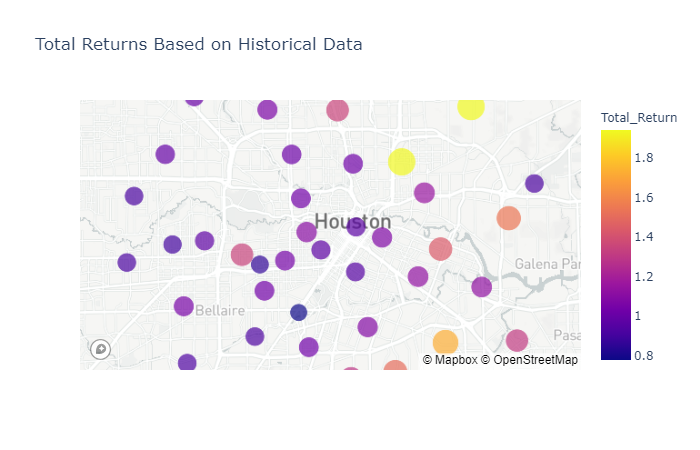
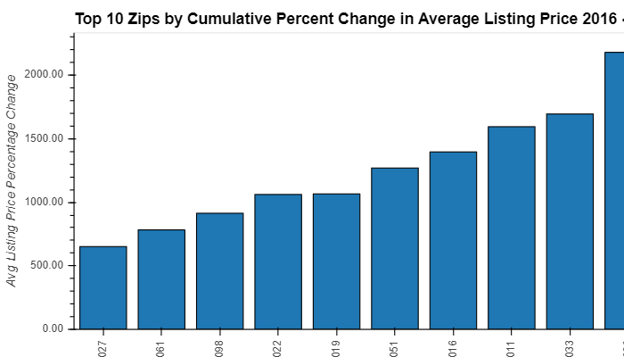
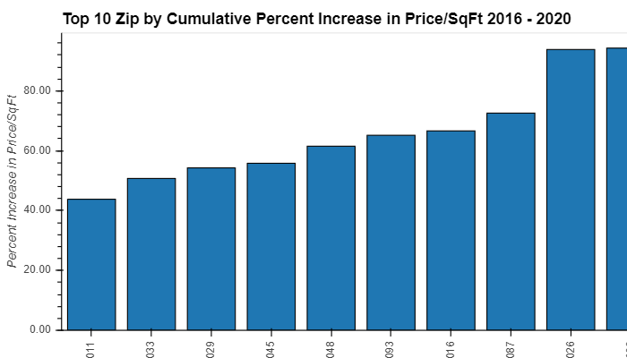
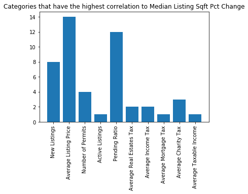
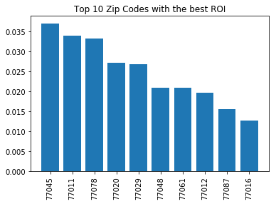
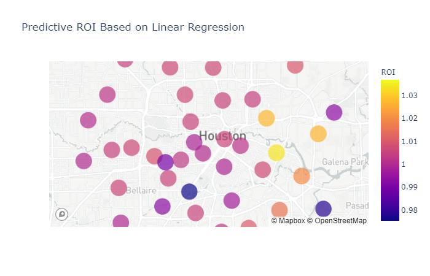

# Project1_FinTech

## Houston Real Estate Investment Analysis

### Objective

- We wanted to identify investment targets in the Houston area based on zip code. 
- We wanted to understand which zip code had the highest increase of price/sqft and how we can use that data to predict future return on investments.
- By ingesting availalbe data filtered by zip code, we also wanted to understand which factors correlated to the price/sqft increase and how we can use that in our analysis tool.
- By creating a few top 10 categories, hopefully we'll find some common zip codes among them and be able to create a hypothesis of which zip code would have the highest return on our investments. 

### Data We Utilized

- Realtor.com data we downloaded as a CSV
- Permit Data we obtained from the City of Houston
- Tax Data we obtained from the IRS

### Hypothesis

- We gathered the top 10 zip codes with an increase over time in price/sqft, amount of permits, changes in percent by listing price and income tax. We've concluded that 77003, 77019 and 77007 should be among our highest returns on investments. 

### Analysis

- We identified the strongest correlation to percent change by zip code.

- Our analysis disproved our hypothesis. The top 10 zip codes with the best return on your investment is shown below. Along with a heat map of where the zip codes are located around Houston.

### Conclusion/Ending Thoughts

- Since our analysis is focused on future returns on investment, it makes some sense that our hypothesis was incorrect. We assumed that over the past 4 years, the zip codes that were doing well would continue to do well at the same rate that they showed. We should've made our hypothesis on future predictions and not past performance. Possibly combining a weighted moving average model with a linear regression model. 

- We realized that our data was not standardized. We were able to locate the information by zip code, however our time frames were off. We couldn't find data that had a consistent time frame throughout. If we had data for the same period, we could support our analysis further.

- The amount of data we ingested wasn't enough. We realized permit data could be broken down into residential vs commercial which could help us distinguish if the area was building more towards commercial or residential real estate. We also did want to target school zones as that could potentially influence parents looking to buy a house. 

- Some of our correlations weren't that strongly correlated. We found a few zip codes that had a correlation of about .03 as their highest correlation to a category. We believe, if we had data for the same time period, this could potentially reduce this error. 

- We didn't gather any data on current events happening. Possibly news of a new stadium being built or new restaurants opening in a certain area could influence prices of the surrounding area. 

- We also mainly looked at houses and not any other type of properties. If we included all types of possible properties, that could sway which zip code has the highest return on your investment. 

### Final Though

- We seeked out to identify which zip code would have the greatest ROI based on past historical data within Houson. What we created was a Python Notebook that you could use to predict ROI based anywhere in Texas. All you have to do is feed it a zip code and how many miles/kilometers of a radius you want it to search within. 

##### Contributors 

- Daniel Smith
- Dennis Perry
- Jack Thomeer
- Mark Ferrer
- Vu Do
